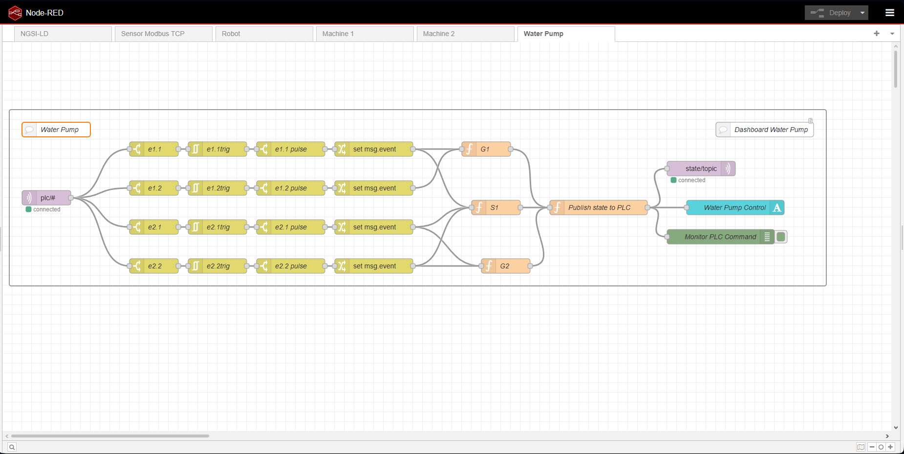

# IIoT Supervisory Control: MQTT Discrete Event System

This repository contains a Node-RED flow that acts as a Supervisory Controller for an industrial PLC. It utilizes the MQTT protocol to implement a Discrete Event System (DES), handling real-time state transitions based on incoming sensor events.

## 🚀 Key Features

* **MQTT Pub/Sub Integration:** Subscribes to raw PLC event streams (`plc/#`) and publishes computed state transitions back to the hardware (`state/topic`).
* **Event Filtering & Pulse Shaping:** Utilizes custom trigger and pulse logic (`e1.1`, `e2.1`, etc.) to convert continuous signals into discrete, actionable events.
* **State Machine Logic:** Implements transition functions (`G1`, `S1`, `G2`) via JavaScript to compute the next valid state of the system based on the current supervisory control algorithm.
* **Fault Tolerance & Retry Logic:** The supervisory state transition diagram incorporates robust error handling. During automated responses, if a transition condition is not fully met, the logic intelligently returns to the designated retry state ($q_3$) to enforce a retry limit, preventing the system from prematurely defaulting to an outright failure state.
* **Live UI Monitoring:** Integrates a real-time Web Dashboard text node (`Water Pump Control`) to provide operators with immediate visual feedback of the current system state.
* **Edge Computing:** Moves the high-level decision-making process from the physical PLC to the IIoT Edge gateway.

## 📊 System Architecture

The control architecture processes incoming MQTT messages, generates clean discrete pulses, and evaluates them through the state logic functions. The computed result is simultaneously published back to the PLC to actuate the new state, and logged to the UI Dashboard for monitoring.

## 🛠️ Technologies Used

* **Node-RED:** For flow-based control logic.
* **MQTT:** Lightweight messaging protocol for IIoT.
* **JavaScript:** For custom state transition algorithms.
* **Supervisory Control Theory:** Applied discrete event logic.

## 💻 How to Run

1. Open your local Node-RED instance.
2. Navigate to the top-right menu (≡) and select **Import**.
3. Upload the `mqtt_supervisory_control.json` file provided in this repository.
4. Ensure you have an MQTT Broker (e.g., Mosquitto) running locally or remotely.
5. Configure the MQTT input/output nodes to connect to your specific broker's IP address and adjust the topics as needed for your PLC configuration.
6. Click **Deploy** to start the supervisory controller.
